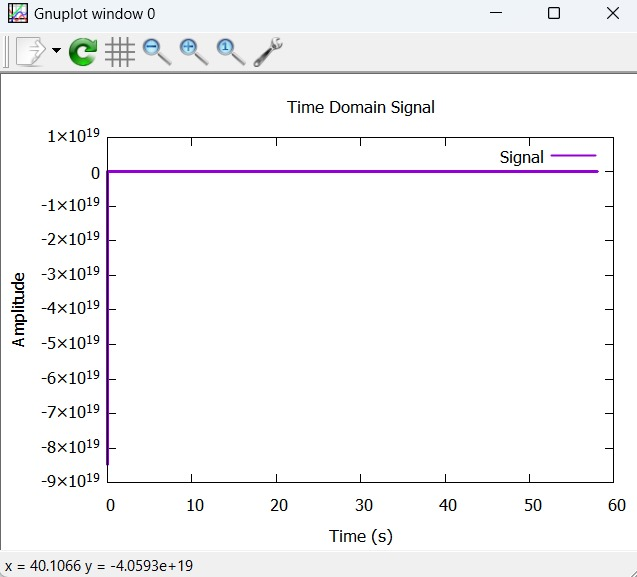
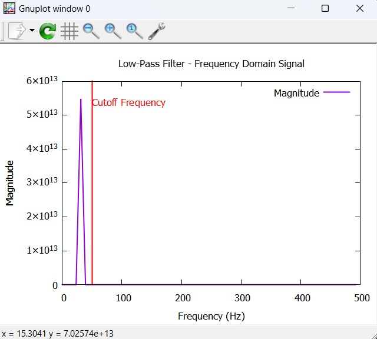
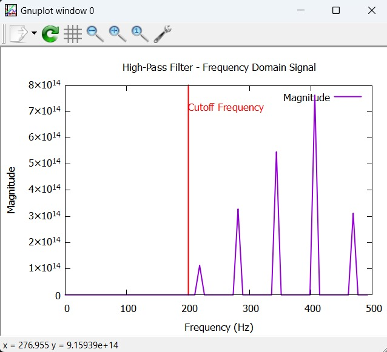

# Frequency Domain Filtering using DFT (C + Gnuplot)

This project performs frequency domain filtering (Low-Pass and High-Pass) on time-series signal data using **Discrete Fourier Transform (DFT)** implemented in **C**, with data visualization done through **Gnuplot**.

---

## 📌 Features

- ⚙️ **DFT Implementation**: Computes the frequency spectrum from time-domain data.
- 🔍 **Filter Options**:
  - **Low-Pass Filter** (cutoff at 50 Hz)
  - **High-Pass Filter** (cutoff at 200 Hz)
- 📈 **Visualization**:
  - Time-domain signal
  - Frequency-domain magnitude spectrum
- 🧠 **User-Controlled Filtering**: Choose filters dynamically at runtime.
- 📁 **Data Logging**: Filtered output data saved to `.txt` files.

---

## 📂 File Structure

```
├── main.c                      # Main source code
├── Readings.txt               # Input file containing time and amplitude data
├── time_domain.txt            # Output: Time-domain data for Gnuplot
├── frequency_domain.txt       # Output: Frequency-domain magnitude data for Gnuplot
├── README.md                  # Project documentation (this file)
```

---

## 🚀 How It Works

1. **Reads** time-domain data from `Readings.txt`
2. **Computes** DFT to transform into the frequency domain
3. **Applies** Low-Pass or High-Pass filter (based on user input)
4. **Calculates** magnitude and phase from the filtered DFT
5. **Generates** two plot files for:
   - `time_domain.txt` (original time signal)
   - `frequency_domain.txt` (filtered frequency magnitude)
6. **Displays plots** via **Gnuplot**

---

## 🛠 Requirements

- **GCC Compiler** (for C)
- **Gnuplot** (for graph plotting)
- `Readings.txt` input format:
  ```
  <time> <amplitude>
  0.000   1.23
  0.001   1.05
  ...
  ```

---

## 🎮 How to Run

1. **Compile**:
   ```bash
   gcc main.c -o filter -lm
   ```

2. **Run**:
   ```bash
   ./filter
   ```

3. **Choose** your filter option:
   ```
   1: Low-Pass Filter
   2: High-Pass Filter
   ```

4. **View the Plots** (they will automatically open using Gnuplot)

---

## 🧪 Example Output

- **Low-Pass Filter**
  - Keeps components below 50 Hz
- **High-Pass Filter**
  - Keeps components above 200 Hz

---

## 📊 Sample Gnuplot Output

- **Time Domain Signal**  
  

- **Frequency Domain Signal (Low-Pass)**  
  

- **Frequency Domain Signal (High-Pass)**  
  

*(Place images in a `screenshots/` folder and update paths if used.)*

---

## 📌 TODO / Future Work

- Add **Band-Pass** and **Band-Stop** filters
- Switch to **Fast Fourier Transform (FFT)** for faster processing
- Integrate a simple GUI (e.g., using GTK or ncurses)

---

## 👨‍💻 Authors

- Aravind RK
- Inspired by DSP concepts & real-time signal analysis projects.

---

## 📄 License

MIT License - feel free to use, modify, and share!
